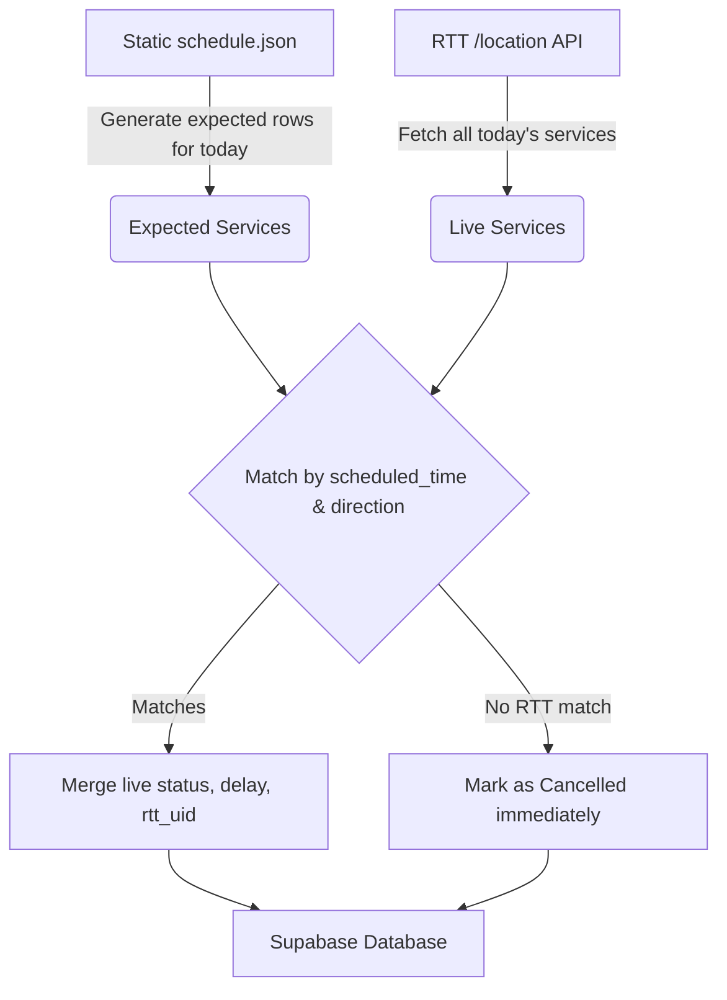

# Poller: Hybrid RTT and Static Schedule Migration — Design

**Date:** 2026-08-02
**Status:** Approved for planning

## Purpose

The previous migration to the Realtime Trains (RTT) API replaced both the real-time data source and the schedule source of truth, eliminating the manually-maintained `schedule.json` file. However, using RTT as the absolute schedule source introduced two problems:
1. It may include non-passenger services if not explicitly filtered.
2. When a scheduled train is cancelled well in advance (e.g., the night before), it may be completely dropped from the RTT daily location feed. Without a baseline schedule, the system simply ignores the missing train rather than explicitly marking it as `cancelled`, depriving users of early warnings.

To fix this and "inform users faster if their scheduled train is early, on time, delayed or cancelled," we are moving to a **Hybrid Model**. The static, officially published PDF schedule (converted to JSON) is reinstated as the absolute source of truth for what *should* run. RTT is retained strictly to provide live updates (`on_time`, `delayed`, `cancelled`) against those expected services.

## Architecture & Data Flow

1. **The Static Schedule (Source of Truth):**
   We introduce `poller/schedule.json` based directly on the user's provided official timetable structure (grouped by `weekday`, `saturday`, `sunday`, and then by `departing`/`arriving`).

2. **Expected Services Generation:**
   At the start of a poll cycle, the poller looks at the current London date and day-of-week, reads `schedule.json`, and generates a base list of `ScheduledServiceRow` objects. By default, their `status` is `pending`, and their `delay_minutes` is `0`.

3. **Live RTT Merging:**
   The poller fetches the full day's data from RTT (`/rtt/location`), as it does today, but instead of mapping RTT services directly to database rows, it attempts to match them to the expected static services using exact `scheduled_time` and `direction`.
   - **If a match is found:** The static row is updated with RTT's `status` (via `isCancelled`, `realtimeActual`, or `realtimeAdvertisedLateness`), `observed_time`, `delay_minutes`, and `rtt_uid`.
   - **If no match is found (The "Faster" part):** If an expected static train is entirely missing from the RTT feed for the day, it is instantly marked as `cancelled`. This provides users an immediate alert long before the train was supposed to depart.

## File Changes

- **Add:** `poller/schedule.json` with the exact timetable data provided.
- **Add:** `poller/src/schedule.ts` (or equivalent helper) to read `schedule.json` and generate `ScheduledServiceRow[]` for a given date.
- **Modify:** `poller/src/rttClient.ts` to implement the matching/merging logic. `fetchTodayRows` will now require the static rows as input and merge RTT data into them.
- **Modify:** `poller/src/index.ts` (Poller loop) to drive this new merge logic.
- **Modify/Add Tests:** Update `rttClient.test.ts` to verify the merge behavior, especially the "missing equals cancelled" logic.

## Error Handling & Edge Cases

- **Tolerances:** We match on exact `scheduled_time` (e.g., `"06:03"`).
- **Network Errors:** Unchanged. RTT API errors or Supabase write failures are retried on the next cycle.
- **Unmatched RTT Services:** Any service present in RTT but *not* in `schedule.json` (e.g., extra freight or empty coaching stock) is safely ignored and dropped, keeping our system clean of non-passenger noise.

## Out of Scope
- Modifying the Next.js frontend or database schema (which still expects `ScheduledServiceRow` shapes).
